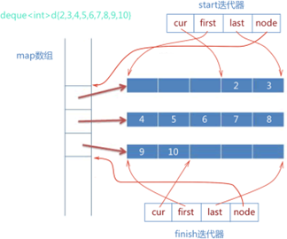

# STL

叶茂林 2025年2月25日

### sort适用性

要求容器的迭代器类型为随机访问迭代器，哈希表看起来是随机访问元素的，但其不是直接访问元素，而是在常数时间内访问到元素，其双向迭代器也不支持偏移量访问

`std::vector`

`std::deque`

`std::array`

`std::string`

### unordered_map

底层实现同unordered_set

开链法，指针数组，每个元素指向一个链表，即桶，通过哈希函数将键key计算出一个哈希值，然后对桶数组的长度取模，放到对应的桶里面，插入链表头

为了维护链表的长度保持一定的短度，有一个负载因子记录元素总数和桶数的比值，超过阈值后增加一倍的桶重新哈希元素，默认最大值是1

### vector

#### 扩容

默认空间为0，GCC2倍扩容，MSVC1.5倍扩容，性能问题，需要内存分配和元素复制，原迭代器失效

#### 赋值实现

首先确定赋值的对象是否和当前对象不同，再确定是否使用相同的分配器，新的容量是否超过当前容量，如果超过申请一块更大的，然后释放原本空间，复制新元素，更新容量和大小

#### 删除元素

如果是erase的话，把要删除位置后面的元素往前移动，如果是pop_back的话，只需要将容器size减一

#### resize和reserve

Reserve：更改容量，改小无效，分配空间不创建对象

Resize：改变size，创建对象，改小删除原有元素，由于没有越界检查，索引访问仍可以访问到原来删除的元素

#### Vector什么时候性能高

随机访问

### map的insert和下标访问区别

insert是插入，下标是访问

下标访问会查找元素，如果没有找到，会使用默认构造函数构造一个，然后返回value引用

Insert查找插入元素的位置，如果可以找到那么调用红黑树的插入操作，如果没有找到说明已经存在key，插入失败

对于相同的key，insert不会更新map，而下标会覆盖原有的值

### 删除元素迭代器失效

List容器erase会返回下一个有效迭代器，后面元素的迭代器不会失效

关联容器map、set不影响后面元素迭代器

序列容器vector、deque后面元素迭代器失效，erase会返回下一个有效迭代器

### Deque实现

stack和queue的底层实现，中央控制表（指针数组）管理多块内存块（数组），两端都可以通过基址加偏移高效删除添加元素

### 优先队列

完全二叉树的堆
