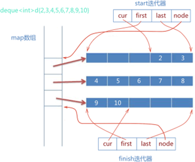

# 数据结构

2024年9月5日 叶茂林

### 堆栈有什么区别

栈是后进先出的数据结构，可以入栈和出栈，可以用数组或者链表实现

堆有最大堆和最小堆，是一种完全二叉树，用于堆排序和优先队列

### 二叉搜索树

二分查找快速定位数据，当每次插入的元素为极值，二分搜索树退化成链表，查询从O(logn)降到O(n)

### 自平衡二叉搜索树

调整树的高度，使得左右子树高度差不超过1

### 红黑树

自平衡的二叉搜索树，查找O(logn)，根节点和叶子节点为黑，红节点的子节点为黑，简单路径上的黑节点数目相同

### 哈希冲突

线性探测、二次探测、开链接、再哈希

### Vector扩容

性能问题，需要内存分配和元素复制，原迭代器失效

### Vector赋值实现

首先确定赋值的对象是否和当前对象不同，再确定是否使用相同的分配器，新的容量是否超过当前容量，如果超过申请一块更大的，然后释放原本空间，复制新元素，更新容量和大小

### Vector删除元素

如果是erase的话，把要删除位置后面的元素往前移动，如果是pop_back的话，只需要将容器size减一

### Vector resize和reserve

Reserve：更改容量，改小无效，分配空间不创建对象

Resize：改变size，创建对象

### Vector什么时候性能高

随机访问

### map的insert和下标访问区别

下标访问会查找元素的迭代器，如果没有找到，会使用默认构造函数构造一个，然后返回value引用

Insert会调底层红黑树的方法查找要插入元素的位置，如果可以找到那么调用红黑树的插入操作，如果没有找到说明已经存在key，插入失败

这两个的使用区别在于对于相同的key，insert不会更新map，而下标会覆盖原有的值

### 迭代器删除元素失效

List容器erase会返回下一个有效迭代器，后面元素的迭代器不会失效

关联容器map、set不影响后面元素迭代器

序列容器vector、deque后面元素迭代器失效，erase会返回下一个有效迭代器

### 容器，迭代器，算法，之间的关系

容器是用来存储和管理数据的数据结构

迭代器时用来访问容器元素的

算法通过迭代器对容器进行操作

### Deque实现

